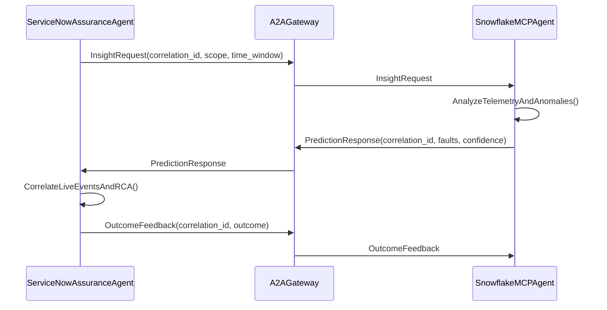

# Agentic Assurance Demo Architecture

## Purpose
Demonstrate agentic lifecycle management and agent-to-agent communication across ServiceNow telecom assurance and Snowflake MCP for proactive fault prediction.

## Assumptions
- ServiceNow telecom-domain apps are available (Service Assurance, Network Inventory).
- Snowflake MCP server is reachable from the demo environment.
- Telemetry history exists in Snowflake (or is seeded for the demo).
- ServiceNow can call external endpoints (MID Server or IntegrationHub).

## Non-Goals
- Production-grade scaling and multi-region failover.
- Full fidelity device control beyond demo remediation actions.
- End-user UI redesign beyond existing ServiceNow experiences.

## Components
- ServiceNow Assurance Agent: orchestrates incident avoidance, correlates live events, initiates RCA and remediation.
- Snowflake MCP Insight/Anomaly Agent: analyzes historical telemetry and anomaly patterns, returns predictions.
- Telemetry Sources: network KPIs, alarms, counters, and SLA metrics landing in Snowflake.
- Agent Lifecycle Manager: tracks agent creation, health, versions, and decommissioning.
- Agent-to-Agent (A2A) Gateway: secure messaging channel between ServiceNow and Snowflake MCP agents.

## Snowflake Data Model (Demo)
- Tables: `NETWORK_KPI`, `ALARMS`, `TOPOLOGY`, `INCIDENTS`, `SITE_GEO`, `SERVICE_FOOTPRINTS`,
  `CHANGE_EVENTS`, `TROUBLE_TICKETS`, `SLA_BREACHES`, `ANOMALY_SCORES`, `CMDB_CI`,
  `CMDB_RELATIONSHIPS`, `EVENT_CORRELATION_RULES`
- Views: `RADIO_KPI_V`, `CORE_KPI_V`, `TRANSPORT_KPI_V`, `CUSTOMER_IMPACT_V`, `TOPOLOGY_V`,
  `INCIDENTS_V`, `SITE_GEO_V`, `SERVICE_FOOTPRINTS_V`, `CHANGE_EVENTS_V`, `TROUBLE_TICKETS_V`,
  `SLA_BREACHES_V`, `ANOMALY_SCORES_V`, `CMDB_CI_V`, `CMDB_RELATIONSHIPS_V`,
  `EVENT_CORRELATION_RULES_V`
- Purpose: provide a clean semantic layer for agent reasoning, CMDB-aware RCA, and correlation.

## End-to-End Flow
1. ServiceNow Assurance Agent receives live events and degraded KPI signals.
2. ServiceNow requests deeper insight via A2A to Snowflake MCP Insight/Anomaly Agent.
3. Snowflake MCP agent queries historical telemetry and anomaly patterns to predict likely faults.
4. Prediction payload returned to ServiceNow with confidence, impacted services, and time horizon.
5. ServiceNow correlates prediction with live events, performs RCA, and executes remediation playbooks.
6. Outcome feedback (resolved, mitigated, false positive) is shared with the Snowflake MCP agent for learning.

## Agent Lifecycle Management
- Registration: each agent registers with ID, capabilities, and version.
- Health checks: periodic heartbeat and latency/error metrics.
- Versioning: agent metadata includes model version and data window.
- Decommissioning: lifecycle manager marks inactive agents and blocks requests.

## A2A Communication Model
The A2A channel is a secure, auditable message exchange with correlation IDs and strict payload schemas.

## Data Flow
- Telemetry ingestion lands in Snowflake tables (metrics, alarms, topology, CMDB tags).
- Snowflake MCP agent reads historical windows and produces prediction signals.
- ServiceNow stores prediction as a knowledge signal and links to live incidents/events.

## API Contracts
### InsightRequest
- `correlation_id` (string, required)
- `requested_by` (string, required)
- `scope` (object: region, service, device_class)
- `time_window` (object: start_ts, end_ts)
- `signals` (array of KPI names)

### PredictionResponse
- `correlation_id` (string, required)
- `predicted_faults` (array of objects: fault_type, confidence, time_horizon)
- `impacted_services` (array of service IDs)
- `evidence` (array of telemetry/anomaly references)

### OutcomeFeedback
- `correlation_id` (string, required)
- `outcome` (string: resolved, mitigated, false_positive)
- `rca_summary` (string, optional)

## Snowflake MCP Server Configuration
- MCP server created in `TELCO_AI_DB.NETWORK_ASSURANCE`.
- Tool types supported: `SYSTEM_EXECUTE_SQL`, `CORTEX_ANALYST_MESSAGE`, `CORTEX_SEARCH_SERVICE_QUERY`, `CORTEX_AGENT_RUN`, `GENERIC`.
- Current demo exposes `SYSTEM_EXECUTE_SQL` as `sql_exec_tool`.
- OAuth recommended; PAT allowed for demos with least-privilege roles.

## Security and Auth
- ServiceNow uses IntegrationHub or MID Server with stored credentials.
- Snowflake MCP server uses key-pair or OAuth with scoped roles.
- Secrets stored in ServiceNow Credential store and Snowflake secrets manager.
- A2A Gateway enforces allow-lists and request signing.

## Governance and Observability
- RBAC on MCP server and tools; separate grants for server and tool usage.
- Correlation IDs logged on both ServiceNow and Snowflake.
- Capture prediction outcomes to track model effectiveness.

## Operational Considerations
- Timeouts and retries for A2A calls; max latency target < 2s for insight.
- Circuit breaker when Snowflake MCP unavailable.
- Observability: correlation_id logged in ServiceNow and Snowflake.

## Limitations
- Snowflake managed MCP server supports tool calls only and non-streaming responses.
- No resources/prompts/notifications in MCP for now; keep tools narrow and explicit.

## Demo Sequence
1. Seed or simulate telemetry in Snowflake for a target region.
2. Trigger a live event in ServiceNow (degraded KPI).
3. ServiceNow sends InsightRequest to Snowflake MCP agent.
4. Snowflake MCP returns PredictionResponse with likely fault.
5. ServiceNow correlates, runs RCA, and applies a remediation playbook.
6. ServiceNow sends OutcomeFeedback to Snowflake MCP agent.

## References
- https://docs.snowflake.com/en/user-guide/snowflake-cortex/cortex-agents-mcp
- https://www.snowflake.com/en/developers/guides/getting-started-with-snowflake-mcp-server/
